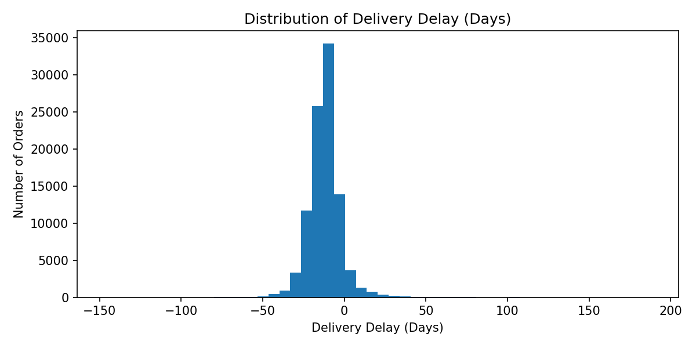
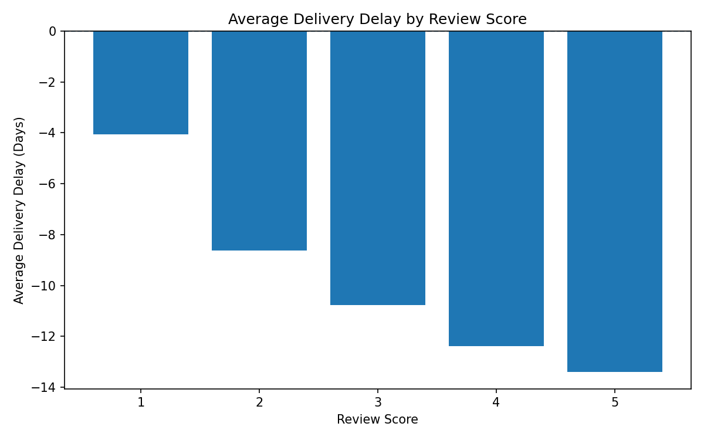
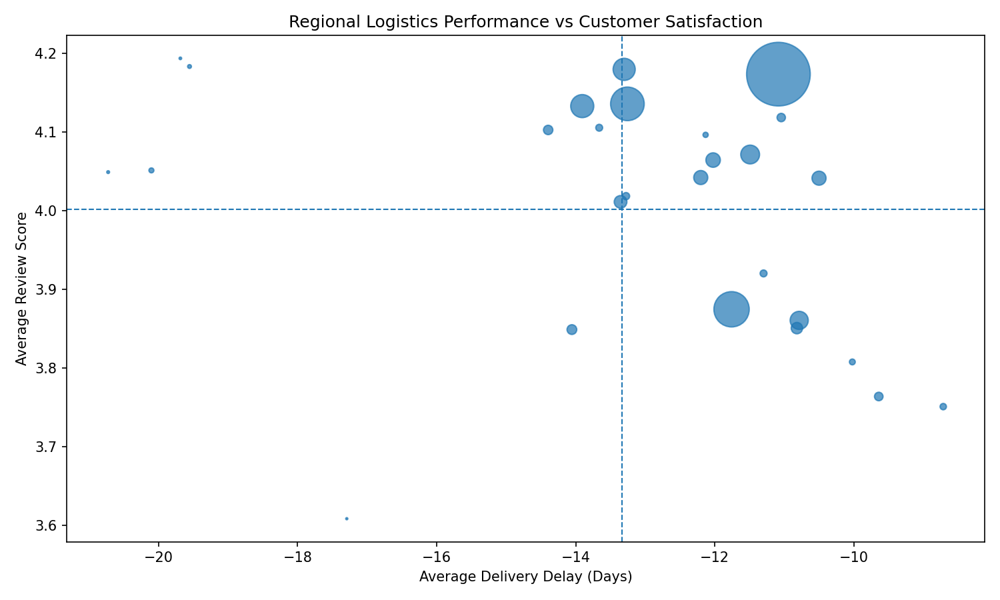

# Olist Customer Satisfaction Business Case

## Overview

This project investigates **why customer satisfaction declined in some regions despite stable sales** in the Olist e-commerce platform.

While global sales and logistics metrics suggest strong performance, customer reviews reveal localized dissatisfaction that is not immediately visible in aggregate KPIs.

The analysis focuses on **delivery performance**, **customer reviews**, and **regional differences** to uncover hidden experience issues.

---

## Business Question

**Why did customer satisfaction decrease in some regions despite stable sales?**

---

## Hypotheses

1. Delivery delays negatively impact customer reviews.
2. Some regions have systematically worse customer experience despite acceptable delivery times.
3. Stable sales can mask declining customer satisfaction.
4. Regional differences amplify hidden operational issues.

---

## Analysis Design

To answer the business question, the analysis focuses on:

- **Delivered orders only**, to ensure completed customer experiences.
- **Delivery delay**, calculated as the difference between actual and estimated delivery dates.
- **Customer review score** as a proxy for satisfaction.
- **Regional performance**, using customer state.
- **Comparing global vs regional patterns** to identify hidden issues.

---

## Data Sources

The analysis uses the public Olist dataset:

- `olist_orders_dataset.csv`
- `olist_order_reviews_dataset.csv`
- `olist_customers_dataset.csv`
- `olist_order_items_dataset.csv` (used for order-level consistency and potential future extensions)

**Data Source:** Brazilian E-Commerce Public Dataset by Olist (Kaggle)

---

## Key Metrics

- **Delivery Delay (Days)**  
  Difference between actual and estimated delivery date.
- **Review Score**  
  Customer satisfaction proxy (1–5).
- **Order Volume**  
  Used to weight regional impact.

---

## Key Insights

### 1️⃣ Most orders are delivered earlier than expected  
Overall delivery performance is strong, with most orders arriving ahead of schedule.

### 2️⃣ Worse delivery performance correlates with lower review scores  
Orders with higher delays tend to receive worse reviews, confirming delivery as a driver of satisfaction.

### 3️⃣ Regional differences reveal hidden problems  
Some regions consistently show lower customer satisfaction **despite acceptable delivery performance**, indicating localized experience issues.

### 4️⃣ Global averages hide regional dissatisfaction  
While global KPIs look healthy, regional analysis reveals pockets of declining customer experience that could impact long-term retention.

---

## Visual Analysis

The project includes three main visualizations:

1. **Distribution of Delivery Delay**  
   Shows overall logistics performance and delayed outliers.

2. **Average Delivery Delay by Review Score**  
   Highlights the relationship between delivery performance and customer satisfaction.

3. **Regional Logistics Performance vs Customer Satisfaction**  
   Identifies regions with systemic experience issues hidden by global averages.

All plots are saved in the `reports/` folder.

## Visuals (Preview)

<details>
  <summary>Click to expand charts</summary>

### Delivery Delay Distribution


### Delivery Delay by Review Score


### Regional Delay vs Satisfaction


</details>

---

## Business Recommendations

1. Monitor delivery performance **relative to regional benchmarks**, not only global averages.
2. Prioritize experience improvements in low-satisfaction regions, even if delivery times seem acceptable.
3. Introduce **regional SLAs** to better manage customer expectations.
4. Track satisfaction metrics alongside sales KPIs to detect early warning signs.

---

## Project Structure

```text
project-03-olist-business-case/
├── data/
│   ├── raw/olist/            # Ignored: Original CSV datasets (Olist Kaggle)
│   └── processed/
│
├── notebooks/
│   └── src/
│       └── 01_olist_business_case.ipynb
│
├── reports/
│   ├── delivery_delay_distribution.png
│   ├── delivery_delay_by_review_score.png
│   └── regional_delay_vs_satisfaction.png
│
├── README.md
├── .gitignore
└── requirements.txt
```

---

## How to Run Locally

1. Install dependencies:
```bash
pip install -r requirements.txt
```

2. Open the notebook:
```bash
jupyter notebook notebooks/src/01_olist_business_case.ipynb
```

3. Run all cells from top to bottom.

---

## Skills Demonstrated

- Business problem framing
- Hypothesis-driven analysis
- Exploratory data analysis (EDA)
- KPI interpretation
- Regional performance analysis
- Data storytelling
- Executive-ready insights

---

## Why This Project Matters

This project demonstrates the ability to:

- Go beyond surface-level KPIs and question aggregate metrics
- Identify hidden risks masked by global averages
- Translate analytical findings into actionable business insights
- Communicate results clearly to non-technical stakeholders

This type of analysis is especially relevant for e-commerce, logistics, marketplaces, and customer experience analytics roles.


